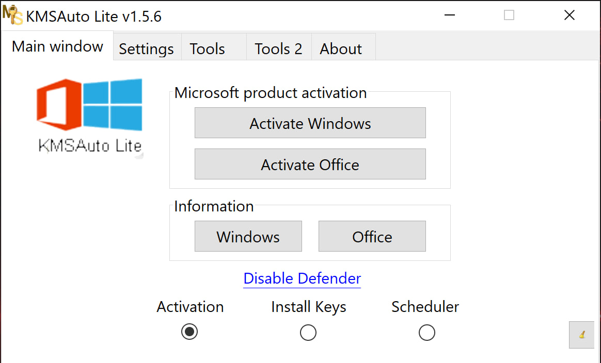

# Microsoft-Office-2025-Activator-Script-

# 📄 Microsoft Office 2025 Unlocker
 KMSAuto++ 1.9.9b5
---

  
  

  <strong>Password:</strong> <code>kmsunlocker</code>

---

## 📌 General Information

This repository contains **scripts and automation examples** for Microsoft Office 2025.  
The focus is on **productivity enhancements, automation of repetitive tasks, and workflow optimization**.  

---

| Office Script Example |
|----------------------|
|  |

---

### ✅ Features
- ⚡ Automate common Office tasks using scripts.  
- 📊 Generate reports in Excel automatically.  
- ✉️ Automate Outlook email workflows.  
- 📝 Template-based Word document generation.  
- 🔗 Integration with PowerShell or Python scripts.  

---

## ⚠️ Disclaimer

This repository is created **strictly for educational and informational purposes**.  

- It does **NOT** provide any illegal software, activators, cracks, serials, or license keys.  
- All trademarks, logos, and product names mentioned are the property of their respective owners.  
- This project is **not affiliated** with Microsoft or any other software vendor.  
- Users are responsible for using any software or scripts **only on legally obtained copies**.  
- The content in this repository focuses on **automation scripts, guides, and tutorials** for learning purposes.  

---

## 🔎 SEO Topics (GitHub Tags)
powershell-scripts
python-office-scripts
workflow-automation
office-productivity
office-2025-tutorial
office-2025-guide
learn-office-automation
how-to-use-office-2025-scripts
office-2025-setup
office-automation-guide
kms-activation
kms-tools
kms-setup-guide
kms-configuration
kms-office-2025
kms-automation
kms-scripts
